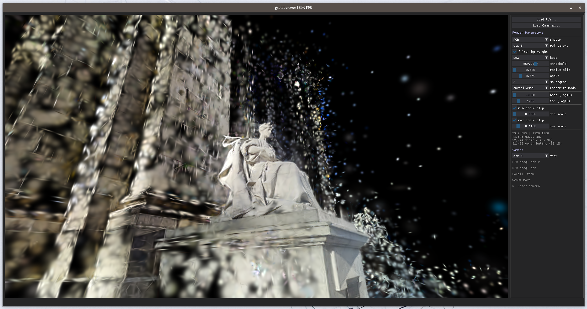

# splatsviewer

Real-time Gaussian Splatting viewer using [gsplat](https://github.com/nerfstudio-project/gsplat) and [DearPyGui](https://github.com/hoffstadt/DearPyGui).

Loads standard 3DGS `.ply` files and renders them interactively on the GPU with an orbit camera and multiple visualization shaders.



## Installation

### Prerequisites

- Python 3.10+
- CUDA-capable GPU with up-to-date drivers
- PyTorch with CUDA support

### Install dependencies

```bash
pip install -r requirements.txt
```

### Install gsplat

gsplat must be installed from source:

```bash
pip install git+https://github.com/nerfstudio-project/gsplat.git --no-build-isolation
```

## Usage

```bash
# Launch with a PLY file
python gsplat_viewer.py path/to/point_cloud.ply

# Launch with PLY and cameras
python gsplat_viewer.py path/to/point_cloud.ply --cameras path/to/cameras.json

# Launch empty (load files from GUI)
python gsplat_viewer.py

# Custom resolution
python gsplat_viewer.py path/to/point_cloud.ply --width 1280 --height 720
```

### Arguments

| Argument | Description | Default |
|---|---|---|
| `ply_path` | Path to a `.ply` file (optional, can load from GUI) | None |
| `--cameras` | Path to a cameras JSON file | None |
| `--width` | Render width in pixels | 1920 |
| `--height` | Render height in pixels | 1080 |

## PLY format

Standard 3DGS `.ply` format with vertex properties:

| Property | Description |
|---|---|
| `x, y, z` | Gaussian center position |
| `f_dc_0, f_dc_1, f_dc_2` | DC spherical harmonics coefficients |
| `f_rest_0, ..., f_rest_N` | Higher-order SH coefficients (optional) |
| `scale_0, scale_1, scale_2` | Log-scale (applied as `exp(scale)`) |
| `rot_0, rot_1, rot_2, rot_3` | Rotation quaternion (wxyz) |
| `opacity` | Logit opacity (applied as `sigmoid(opacity)`) |

Also supports vertex-color format (`red, green, blue` as 0-255) and custom feature format (`feature_0, feature_1, feature_2`).

## Camera JSON format

```json
{
    "scene": "scene_id",
    "context": {
        "extrinsics": [
            [[r00, r01, r02, tx], [r10, r11, r12, ty], [r20, r21, r22, tz], [0, 0, 0, 1]],
            ...
        ],
        "intrinsics": [
            [[fx, 0, cx], [0, fy, cy], [0, 0, 1]],
            ...
        ]
    },
    "target": {
        "extrinsics": [...],
        "intrinsics": [...]
    },
    "resolution": [H, W]
}
```

### Conventions

- **Extrinsics**: 4x4 camera-to-world (c2w) matrices
- **Intrinsics**: 3x3 normalized matrices where `fx`, `fy` < 1 and `cx`, `cy` ~ 0.5. These are automatically scaled to the render resolution at load time.
- **Groups**: `context` and `target` are both optional. Cameras are named `ctx_0`, `ctx_1`, ..., `tgt_0`, `tgt_1`, ...

## File structure

```
splatsviewer/
├── gsplat_viewer.py    # Main viewer application
├── orbit_camera.py     # Self-contained orbit camera module
├── requirements.txt    # Python dependencies
└── README.md
```
